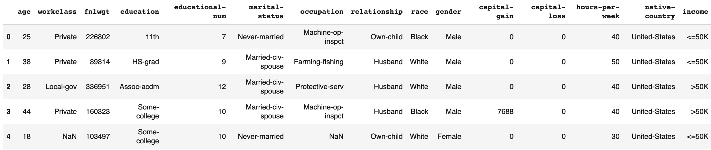
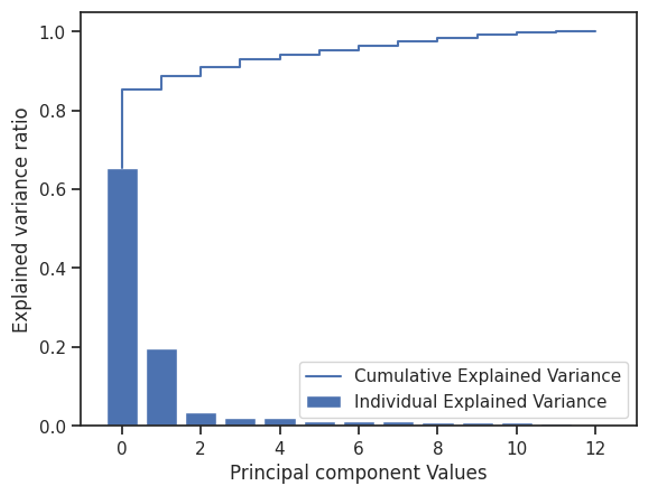

# ML-Adult-Income-Classification

**1. Problem Statement**: 

In today’s world, understanding the factors that influence income can help us identify ways to improve economic opportunities and reduce income inequality. In this project, we will be analyzing the Adult Income dataset to predict whether an individual earns over $50,000 per year or not, based on their demographic and employment information.
To achieve this classification task, we will be using five different machine learning algorithms: Naive Bayes, Logistic Regression, Support Vector Machine, KNN, tree_based models, and Neural Network. Each Algorithm has its own strengths and weaknesses, and by applying multiple algorithms, we can compare their performances and select the best model for this specific problem.
Our dataset contains various features such as age, education level, occupation, marital status, and more, which can all be used to predict an individual’s income level. By training our models on the data and evaluating their precision, recall and F1 score, we can determine which algorithm performs the best on this task and gain insights into the key factors that influence income.

**2. Data Descriptions**

Dataset Source: https://archive.ics.uci.edu/ml/datasets/adult
Dataset Details:
This dataset has 48842 instances and 14 attributes, including categorical and integer attributes.

**2.1. Feature Description**

|Feature Name|	Data Type|	Description of Variable|Percentage of Missing Values|
|:---:|:---:|:---:|:---:|
|Age|Numeric|The age of the individual| -|
|WorkClass|	String|	Simplified employment status of an individual|	5.73%|
|fnlgwt|Numeric|Final weight of the record. Basically interpret as the number of people represented by this row| -|
|Education|	String|	The education level|	-	|
|Education Num|	Numeric|The education level is ascending positive integer value|- |
|Martial Status|	String|	Martial status of a person| -|		
|Occupation	|String	|Category of the occupation	|5.75%|	
|Relationship|	String|	Relationship in terms of family| -|		
|Race|	String|	Race of the person|		-|
|Sex|	String|	Gender at birth| -|
|Capital Gain|	Numeric|	Dollar gain of capital|- |		
|Capital loss|	Numeric|	Dollar loss of capital| -|		
|Hours per week|	Numeric|	Working hours per week| -|		
|Native country|	String|	Country at birth	|1.75%|	

**2.2. Data Overview**

**3. Workflow**

 

**4. Exploratory Data Analysis(EDA)</a>**

Before implementing any models, we performed EDA on our Training Dataset. This process helps us to understand our dataset better. Statistical insights include the correlation between features, how the data is spread among the mean values, what hypothesis we can make based on the statistical information, which model would better fit, etc.

**4.1. Statistical Summary of Numerical Features**

**Initial Observations:** 
1. The average age of the working classes is 38, and the average year of education is 10 years.
2. 90% of the people did not have capital gain or loss in the early 90s
3. The average of hours worked per week is 40.       

**4.2. Target Class**

**5. Data Cleaning**

During EDA goal was to understand the distribution of data in various columns and understand why null values or missing values occur. 

1.  numerical columns did not contain any missing values. Two columns capital-gain and capital-loss contained high skew of zero values. These columns can be used as numerical columns or one hot encoded to show zero or non-zero values. The signal from these columns could be important indicators for income classification.

2.  categorical columns contained *NAs* and *"?"*. All missing values, NAs, and "?" were studied and no clear pattern was found. All missing values, NAs, and "?" were converted to "NULL" values, for example, `workclass` and `occupation` in row 4 are "NULL". Multiple approaches can be done here. Substituting missing values with the most common values in column etc. But in this project, these missing values are considered as a separate category.

Also from EDA, we learn that educational num and education category columns can be mapped one to one. So, one column can be dropped.

There were **48 duplicate** rows in the 48K rows. These rows can be dropped as they do not provide additional information for classification.

**6. Feature Engineering**

The training dataset contained numerical and categorical columns. We performed data transformation on the original dataset and converted the data into three formats: **all numerical**, **all categorical**, and **mixed categorical and numerical**.

The techniques we have used are One hot encoding and ordinal encoding for converting categorical data into numerical data; we also used standardization and min-max normalization on all numerical data. The goal of the project was to assess:

1.  **Impact of binning:** Converting numerical columns like Age into Age bin categories. The model would be input with all numerical columns fit transformed and converted to categories and categorical columns as categories themselves. The same binning transformation would be applied to validation and test datasets.
2.  **Impact of scaling:** Numerical columns were evaluated for Standard Scaling and Min Max Scaling. It is important to understand how the model performs when numerical columns are transformed in either way. Also, need to check the outlier handling in the transformed dataset.
3.  **Ordinal Encoding:** Categorical columns cannot be input directly into models. All categories are encoded into ordinal categories. Ordinal categories can be also used to show the order of categories.

**Overall, three datasets were created:**

1.  Categorical dataset: Contained numerical columns binned into categories and kept all categorical columns.
2.  Numerical dataset: Contained all numerical columns and categorical columns encoded to 0 and 1 for each column category if the category was not ordinal. A column like 'education' was dropped as the education number column could be used.
3.  Mixed dataset: Contained both numerical and categorical columns in their raw form

All these techniques will generate different performances based on models, and this will give us more options for choosing the best fit.

**6.1 Principal Component Analysis**

We observed from EDA that there is complexity in the dataset, data is not linearly related and there are complex nonlinear relationships in the dataset. So, we decided to also evaluate the impact of applying Principal component analysis on the dataset and converting the data into
a lower dimensional principal component with the most information. Next, by implementing PCA, we found that the first two components contain over 90% of the information in this dataset. However, the limitation of this
method is that we do not know which feature is important to us. We may be able to get model performance close to best-performing model performances with very few Principal components, but we lose explainability. So, we will be using two principal components to compare with the performance of models without PCA.

**7. Statistical Learning Algorithms**

Model implementation: we used sk-learn's ideal performance as a benchmark and compared it to the performance of our own models. For some cases, we also used sk-learn's model hyperparameters to fine-tune our own models. We are evaluating the performance of each algorithm using precision, recall, F1 score, AUC, and accuracy.

For our dataset, we are applying the above pre-processing techniques as described in previous sections. We make sure no data frame is manipulated when using different models. This way we ensured no change take place after the initial pre-processing. We can evaluate the impact of each technique by the performance of the algorithms. For example, we can determine whether standardization or normalization improves the performance of a particular algorithm, or whether PCA reduces the dimensionality of the data while maintaining its predictive power.

