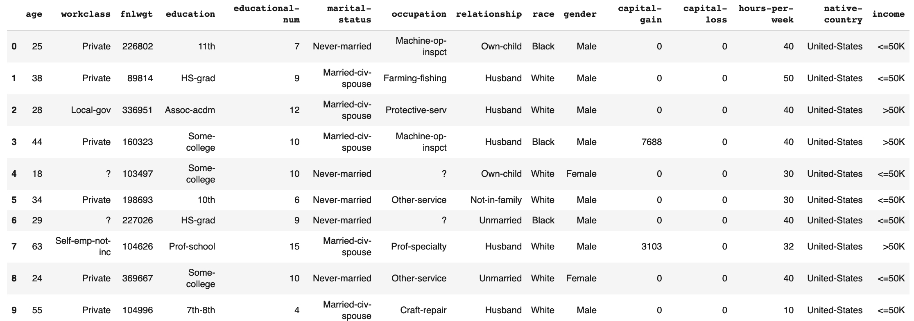
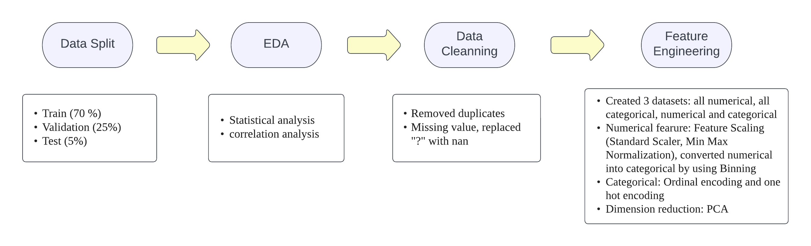
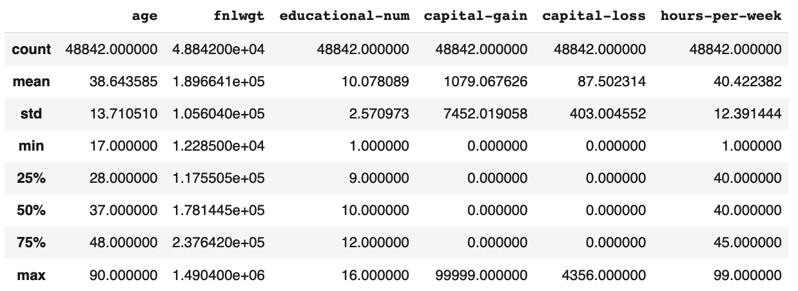
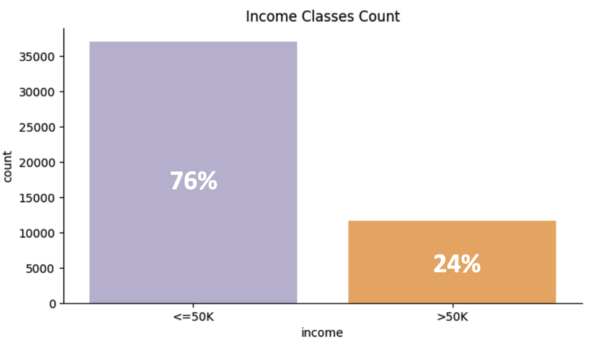

# ML-Adult-Income-Classification

**1. Problem Statement**: 

In today’s world, understanding the factors that influence income can help us identify ways to improve economic opportunities and reduce income inequality. In this project, we will be analyzing the Adult Income dataset to predict whether an individual earns over $50,000 per year or not, based on their demographic and employment information.
To achieve this classification task, we will be using five different machine learning algorithms: Naive Bayes, Logistic Regression, Support Vector Machine, KNN, tree_based models, and Neural Network. Each Algorithm has its own strengths and weaknesses, and by applying multiple algorithms, we can compare their performances and select the best model for this specific problem.
Our dataset contains various features such as age, education level, occupation, marital status, and more, which can all be used to predict an individual’s income level. By training our models on the data and evaluating their precision, recall and F1 score, we can determine which algorithm performs the best on this task and gain insights into the key factors that influence income.

**2. Data Descriptions**

Dataset Source: https://archive.ics.uci.edu/ml/datasets/adult
Dataset Details:
This dataset has 48842 instances and 14 attributes, including categorical and integer attributes.

**2.1. Feature Description**

|Feature Name|	Data Type|	Description of Variable|Percentage of Missing Values|
|:---:|:---:|:---:|:---:|
|Age|Numeric|The age of the individual| -|
|WorkClass|	String|	Simplified employment status of an individual|	5.73%|
|fnlgwt|Numeric|Final weight of the record. Basically interpret as the number of people represented by this row| -|
|Education|	String|	The education level|	-	|
|Education Num|	Numeric|The education level is ascending positive integer value|- |
|Martial Status|	String|	Martial status of a person| -|		
|Occupation	|String	|Category of the occupation	|5.75%|	
|Relationship|	String|	Relationship in terms of family| -|		
|Race|	String|	Race of the person|		-|
|Sex|	String|	Gender at birth| -|
|Capital Gain|	Numeric|	Dollar gain of capital|- |		
|Capital loss|	Numeric|	Dollar loss of capital| -|		
|Hours per week|	Numeric|	Working hours per week| -|		
|Native country|	String|	Country at birth	|1.75%|	

**2.2. Data Overview**

**3. Workflow**

 

**4. Exploratory Data Analysis(EDA)</a>**

Before implementing any models, we performed EDA on our Training Dataset. This process helps us to understand our dataset better. Statistical insights include the correlation between features, how the data is spread among the mean values, what hypothesis we can make based on the statistical information, which model would better fit, etc.

**4.1. Statistical Summary of Numerical Features**

**Initial Observations:** 
1. The average age of the working classes is 38, and the average year of education is 10 years.
2. 90% of the people did not have capital gain or loss in the early 90s
3. The average of hours worked per week is 40.       

**4.2. Target Class**

