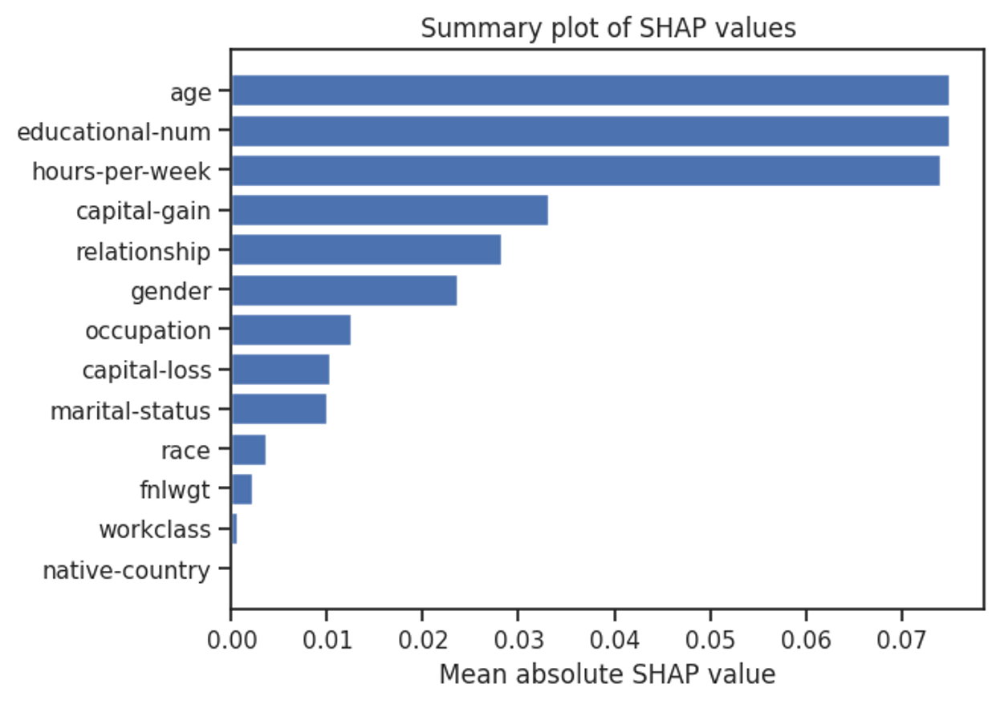
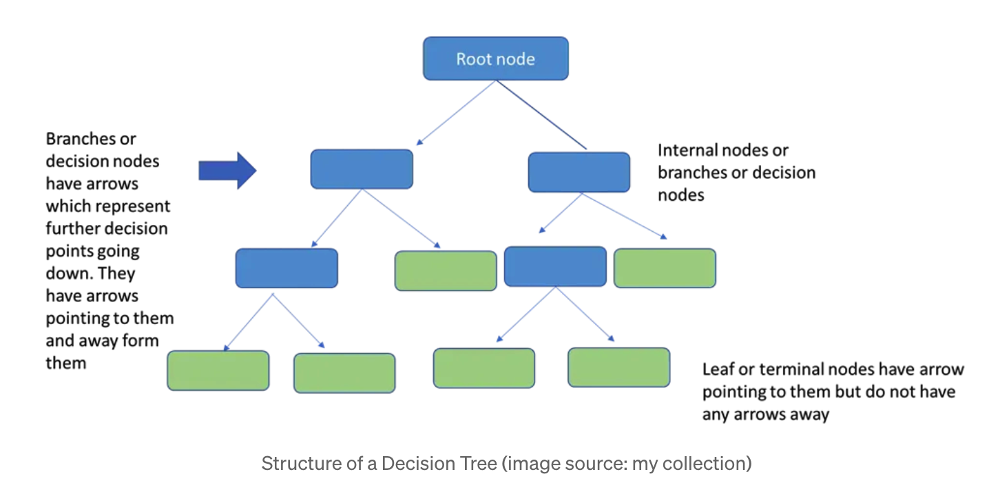
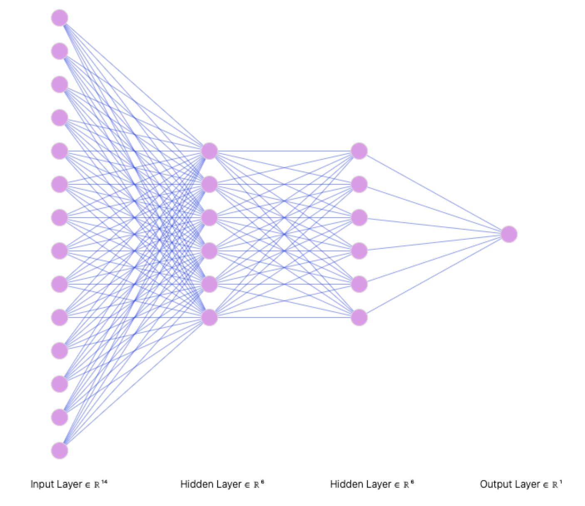
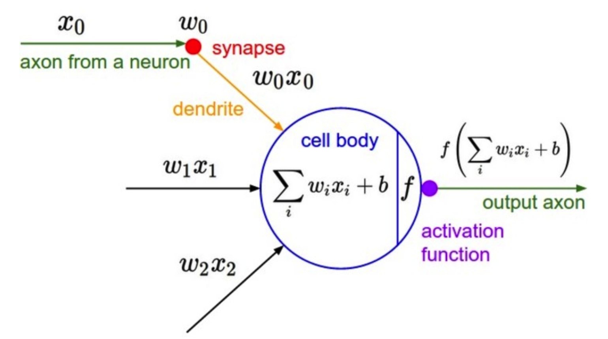
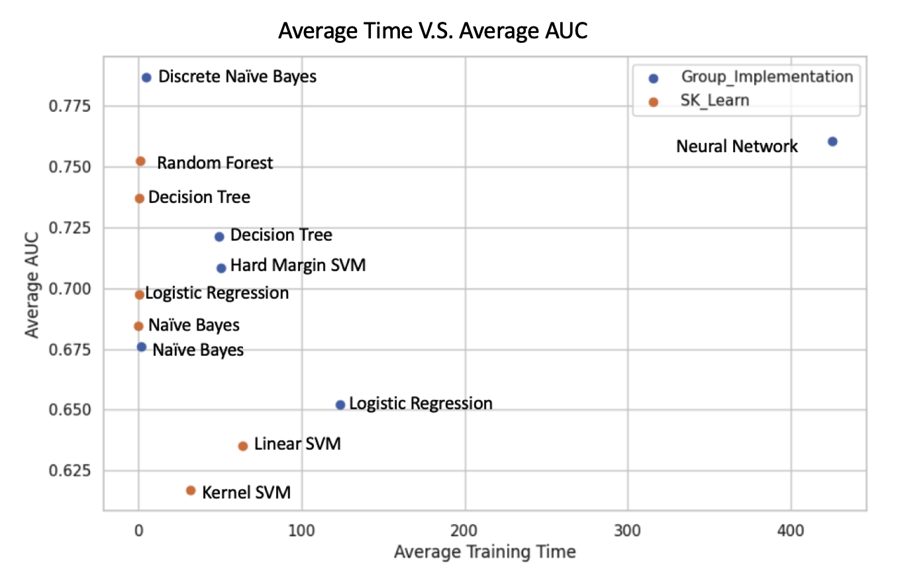
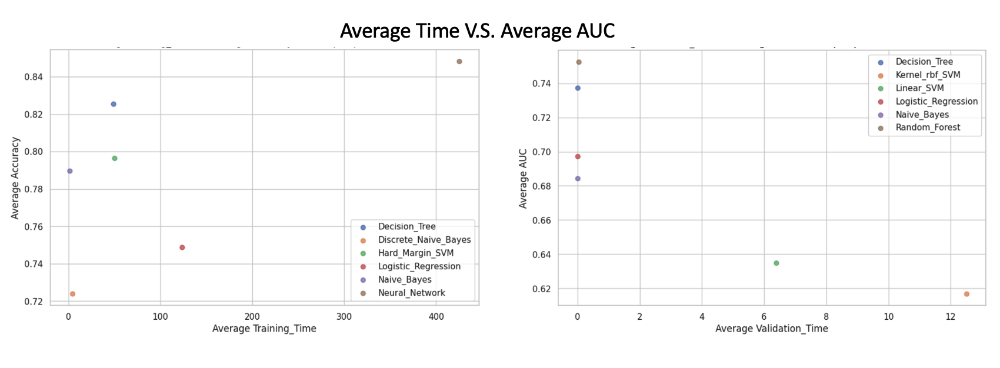
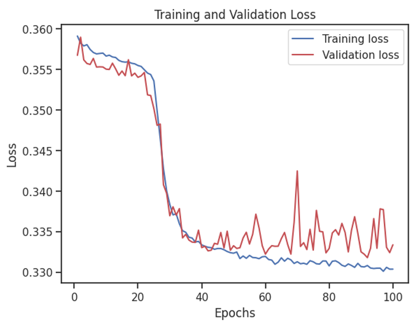
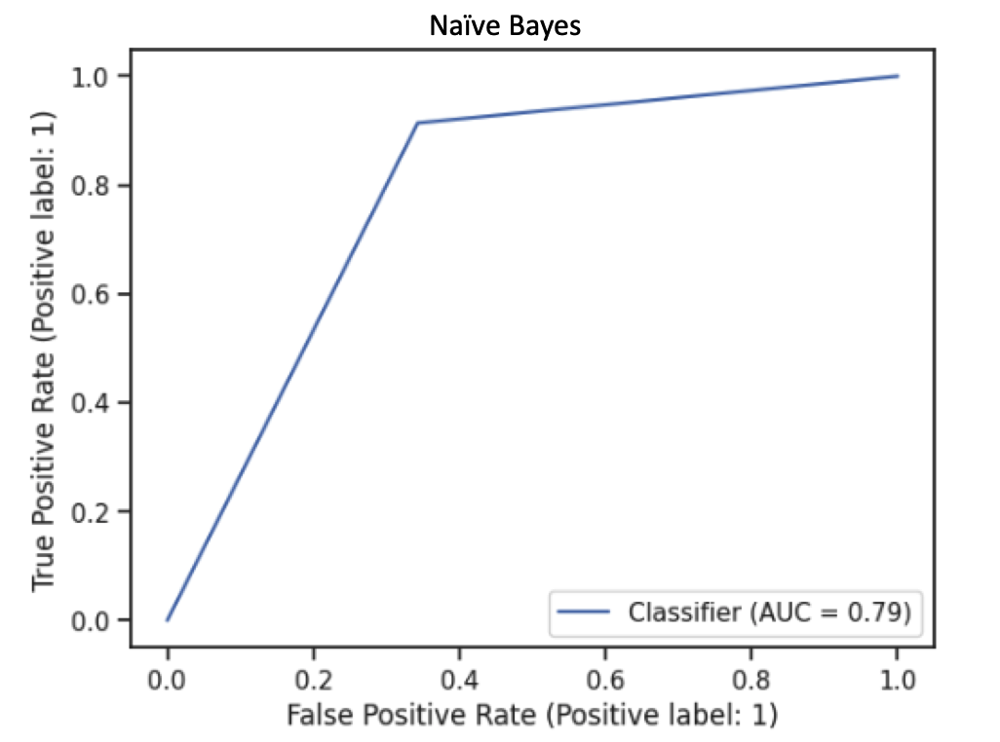
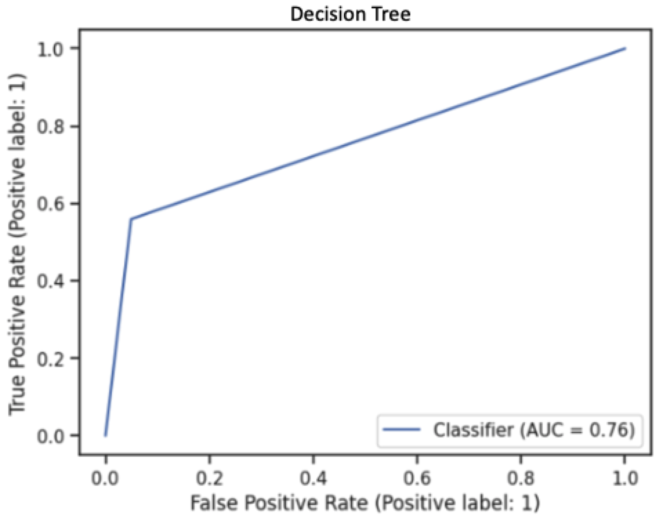
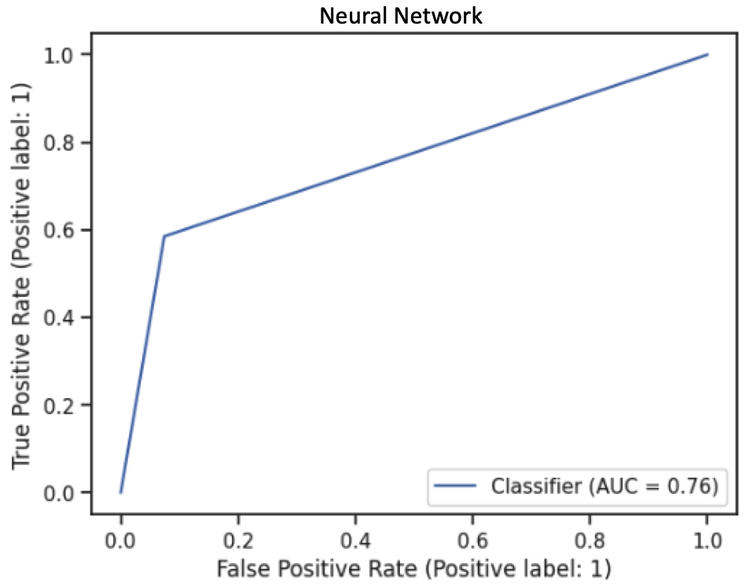

# ML-Adult-Income-Classification

**1. Problem Statement**: 

In today’s world, understanding the factors that influence income can help us identify ways to improve economic opportunities and reduce income inequality. In this project, we will be analyzing the Adult Income dataset to predict whether an individual earns over $50,000 per year or not, based on their demographic and employment information.
To achieve this classification task, we will be using five different machine learning algorithms: Naive Bayes, Logistic Regression, Support Vector Machine, KNN, tree_based models, and Neural Network. Each Algorithm has its own strengths and weaknesses, and by applying multiple algorithms, we can compare their performances and select the best model for this specific problem.
Our dataset contains various features such as age, education level, occupation, marital status, and more, which can all be used to predict an individual’s income level. By training our models on the data and evaluating their precision, recall and F1 score, we can determine which algorithm performs the best on this task and gain insights into the key factors that influence income.

**2. Data Descriptions**

Dataset Source: https://archive.ics.uci.edu/ml/datasets/adult
Dataset Details:
This dataset has 48842 instances and 14 attributes, including categorical and integer attributes.

**2.1. Feature Description**

|Feature Name|	Data Type|	Description of Variable|Percentage of Missing Values|
|:---:|:---:|:---:|:---:|
|Age|Numeric|The age of the individual| -|
|WorkClass|	String|	Simplified employment status of an individual|	5.73%|
|fnlgwt|Numeric|Final weight of the record. Basically interpret as the number of people represented by this row| -|
|Education|	String|	The education level|	-	|
|Education Num|	Numeric|The education level is ascending positive integer value|- |
|Martial Status|	String|	Martial status of a person| -|		
|Occupation	|String	|Category of the occupation	|5.75%|	
|Relationship|	String|	Relationship in terms of family| -|		
|Race|	String|	Race of the person|		-|
|Sex|	String|	Gender at birth| -|
|Capital Gain|	Numeric|	Dollar gain of capital|- |		
|Capital loss|	Numeric|	Dollar loss of capital| -|		
|Hours per week|	Numeric|	Working hours per week| -|		
|Native country|	String|	Country at birth	|1.75%|	

**2.2. Data Overview**

**3. Workflow**

 

**4. Exploratory Data Analysis(EDA)</a>**

Before implementing any models, we performed EDA on our Training Dataset. This process helps us to understand our dataset better. Statistical insights include the correlation between features, how the data is spread among the mean values, what hypothesis we can make based on the statistical information, which model would better fit, etc.

**4.1. Statistical Summary of Numerical Features**

**Initial Observations:** 
1. The average age of the working classes is 38, and the average year of education is 10 years.
2. 90% of the people did not have capital gain or loss in the early 90s
3. The average of hours worked per week is 40.       

**4.2. Target Class**

**5. Data Cleaning**

During EDA goal was to understand the distribution of data in various columns and understand why null values or missing values occur. 

1.  numerical columns did not contain any missing values. Two columns capital-gain and capital-loss contained high skew of zero values. These columns can be used as numerical columns or one hot encoded to show zero or non-zero values. The signal from these columns could be important indicators for income classification.

2.  categorical columns contained *NAs* and *"?"*. All missing values, NAs, and "?" were studied and no clear pattern was found. All missing values, NAs, and "?" were converted to "NULL" values, for example, `workclass` and `occupation` in row 4 are "NULL". Multiple approaches can be done here. Substituting missing values with the most common values in column etc. But in this project, these missing values are considered as a separate category.

Also from EDA, we learn that educational num and education category columns can be mapped one to one. So, one column can be dropped.

There were **48 duplicate** rows in the 48K rows. These rows can be dropped as they do not provide additional information for classification.

**6. Feature Engineering**

The training dataset contained numerical and categorical columns. We performed data transformation on the original dataset and converted the data into three formats: **all numerical**, **all categorical**, and **mixed categorical and numerical**.

The techniques we have used are One hot encoding and ordinal encoding for converting categorical data into numerical data; we also used standardization and min-max normalization on all numerical data. The goal of the project was to assess:

1.  **Impact of binning:** Converting numerical columns like Age into Age bin categories. The model would be input with all numerical columns fit transformed and converted to categories and categorical columns as categories themselves. The same binning transformation would be applied to validation and test datasets.
2.  **Impact of scaling:** Numerical columns were evaluated for Standard Scaling and Min Max Scaling. It is important to understand how the model performs when numerical columns are transformed in either way. Also, need to check the outlier handling in the transformed dataset.
3.  **Ordinal Encoding:** Categorical columns cannot be input directly into models. All categories are encoded into ordinal categories. Ordinal categories can be also used to show the order of categories.

**Overall, three datasets were created:**

1.  Categorical dataset: Contained numerical columns binned into categories and kept all categorical columns.
2.  Numerical dataset: Contained all numerical columns and categorical columns encoded to 0 and 1 for each column category if the category was not ordinal. A column like 'education' was dropped as the education number column could be used.
3.  Mixed dataset: Contained both numerical and categorical columns in their raw form

All these techniques will generate different performances based on models, and this will give us more options for choosing the best fit.

**6.1 Principal Component Analysis**

We observed from EDA that there is complexity in the dataset, data is not linearly related and there are complex nonlinear relationships in the dataset. So, we decided to also evaluate the impact of applying Principal component analysis on the dataset and converting the data into
a lower dimensional principal component with the most information. Next, by implementing PCA, we found that the first two components contain over 90% of the information in this dataset. However, the limitation of this
method is that we do not know which feature is important to us. We may be able to get model performance close to best-performing model performances with very few Principal components, but we lose explainability. So, we will be using two principal components to compare with the performance of models without PCA.

**7. Statistical Learning Algorithms**

Model implementation: we used sk-learn's ideal performance as a benchmark and compared it to the performance of our own models. For some cases, we also used sk-learn's model hyperparameters to fine-tune our own models. We are evaluating the performance of each algorithm using precision, recall, F1 score, AUC, and accuracy.

For our dataset, we are applying the above pre-processing techniques as described in previous sections. We make sure no data frame is manipulated when using different models. This way we ensured no change take place after the initial pre-processing. We can evaluate the impact of each technique by the performance of the algorithms. For example, we can determine whether standardization or normalization improves the performance of a particular algorithm, or whether PCA reduces the dimensionality of the data while maintaining its predictive power.

### 7.1. Naive Bayes

For Naive Bayes, we assume that all features are independent of each other, and numerical feature follows a Gaussian distribution.

Discrete feature:
$𝑃(𝑦|X_1,...,X_𝑛)\propto\ 𝑙𝑖𝑘𝑒𝑙𝑖h𝑜𝑜𝑑 * 𝑝𝑟𝑖𝑜𝑟 = 𝑃(𝑋_i | 𝑦 = 𝑘) * 𝑃(𝑦 = 𝑘)$

Continuous feature:
$$𝑃(𝑋|𝑦 = 𝑘) ~ 𝑁(\mu_{ki} , \sigma_{ki}^2), 𝑓(𝑥) = \frac{1}{\sqrt{2 \pie \sigma^2}}* 𝑒^(𝑥_𝑖 − μ_𝑖_𝑗)^2$$

|Model Type|	Data Structure|	AUC |	Accuracy|	F1 Score|	Recall|	Precision|
|:---|:---:|:---:|:---:|:---:|:---:|:---:|
|scikit-learn|	Mixed Features|	0.68|	0.81|	0.70|	0.42|	0.66|
|scikit-learn|	Categorical| 	0.80|	0.81|	0.77|	0.77|	0.58|
|scikit-learn|	Standard Scaler|	0.64|	0.81|	0.66|	0.31|	0.70|
|scikit-learn|	Min Max Scaler|	0.64|	0.81|	0.66|	0.31|	0.70|
|scikit-learn|	PCA|	0.62|	0.78|	0.64|	0.32|	0.58|
|Numpy Implementation|	Categorical| 	0.79|	0.72|	0.70|	0.91|	0.46|
|Numpy Implementation|	Mixed Features|	0.70|0.83|0.73|0.45|0.73|
|**Numpy Implementation**|**Categorical**| **0.79**|**0.72**|**0.70**|**0.91**|**0.46**|
|Numpy Implementation|	Standard Scaler|	0.64|	0.81|	0.66|	0.31|	0.70|
|Numpy Implementation|	Min Max Scaler|	0.62|	0.78|	0.64|	0.32|	0.58|
|Numpy Implementation|	PCA	|0.62|	0.78|	0.64|	0.32|	0.58|	0.22|
-   Our best-performing model for the Naive Bayes algorithm is the one implemented by using "numpy" with all categorical features, which achieved an AUC of **0.79**.
-   We set the hyperparameter of Laplace smoothing - True/False and lambda = 1.

### 7.2. Logistic Regression 

The logistic regression model was implemented using an sk-learn model and our code on standard scalar, MinMax scalar, and PCA dataset.

For logistic regression, we want to understand the relative importance of each feature in determining the class label. To understand that, we used [SHapley Additive exPlanations(SHAPE)](https://analyticsindiamag.com/a-complete-guide-to-shap-shapley-additive-explanations-for-practitioners/#:~:text=What%20is%20SHAP%3F-,SHAP%20or%20SHAPley%20Additive%20exPlanations%20is%20a%20visualization%20tool%20that,explainable%20by%20visualizing%20its%20output.) values, which provide a way to assign a numerical importance score to each feature.

|Model Type|	Data Structure|	AUC |	Accuracy|	F1 Score|	Recall|	Precision|
|:---|:---:|:---:|:---:|:---:|:---:|:---:|
|scikit-learn|	Standard Scaler|	0.70|	0.83|	0.73|	0.45|	0.74|
|scikit-learn|	Min Max Scaler|	0.69|	0.82|	0.71|	0.44|	0.68|
|scikit-learn|	PCA|	0.70|	0.83|	0.73|	0.45|	0.74|
|Numpy Implementation|Standard Scaler|	0.66|	0.77|	0.67|	0.46|	0.52|
|Numpy Implementation|	Min Max Scaler|	0.52|	0.74|	0.51|	0.12|	0.34|
|**Numpy Implementation**|**PCA**|**0.77**|**0.74**|**0.70**|**0.82**|**0.47**|

-   Best model is all numerical features with standard scaling using "Numpy" implemented model, the AUC is **0.77**
-   We applied Gradient Descent for cost minimization.

#### 7.2.1.  Feature Importance (Implementation of SHAP)

The [SHAP values](https://analyticsindiamag.com/a-complete-guide-to-shap-shapley-additive-explanations-for-practitioners/#:~:text=What%20is%20SHAP%3F-,SHAP%20or%20SHAPley%20Additive%20exPlanations%20is%20a%20visualization%20tool%20that,explainable%20by%20visualizing%20its%20output.) are calculated by randomly perturbing a single feature in the validation set and measuring the effect on the model's prediction. This process is repeated multiple times to obtain a stable estimate of the SHAP values for each feature.

-   SHapley Additive exPlanations is the showcase contribution of a feature to the prediction probability of income that is greater than \$50k.

-   As we can see, Age, Education level, and hours per week are essential in estimating the prediction probability of target classes.

### 7.3. Support Vector Machine (SVM)

The goal of SVM is to find a hyperplane that maximally separates data points into different classes. With 14 features, it can be difficult to visualize the results, but our goal is to find class separation between income groups on the 14 features.

For our project, we implemented a hard margin SVM model by defining various functions and performing hyperparameter tuning.

$$Min_{w, b}  \ \ \frac{1}{2}||w||_2^2 $$ $$ s.t. (w.x_j + b)y_j ≥ 1,  for j = 1, ..., n $$

The Adult Income dataset is complex and non-linear, which means that a Hard SVM linear model may not perform well.

|Model Name|Model Type|	Data Structure|	AUC |	Accuracy|	F1 Score|	Recall|	Precision|
|:---|:---:|:---:|:---:|:---:|:---:|:---:|:---:|
|Linear SVM|	scikit-learn|	Standard Scaler|	0.64|	0.82|	0.66|	0.29|	0.82|
|Linear SVM|	scikit-learn|	Min Max Scaler|	0.63|	0.82|	0.66|	0.28|	0.84|
|Linear SVM|	scikit-learn|	PCA|	0.64|	0.82|	0.66|	0.29|	0.82|
|Kernel rbf SVM|	scikit-learn|	Standard Scaler|	0.62|	0.81|	0.64|	0.26|	0.86|
|Kernel rbf SVM|	scikit-learn|	Min Max Scaler|	0.50|	0.76|	0.43|	0.00|	0.00|
|Kernel rbf SVM|	scikit-learn|	PCA|	0.73|	0.85|	0.76|	0.50|	0.77|
|Hard Margin SVM|	Numpy Implementation|	Standard Scaler|	0.65|	0.82|	0.15|	0.31|	0.83|
|Hard Margin SVM|	Numpy Implementation|	Min Max Scaler|	0.73|	0.85|	0.76|	0.50|	0.77|
|**Hard Margin SVM**|**Numpy Implementation**|**PCA**|**0.77**|**0.75**|**0.20**|**0.82**|**0.48**|

For the Support Vector Machine model, we got the best performance for the model we implemented on the standard scalar dataset after hyperparameter tuning, which has an AUC of **0.77**

### 7.4. K- Nearest Neighbours (KNN)

The KNN algorithm is a non-parametric algorithm that classifies new data points based on their proximity to existing data points in the training set.

$$dist_{x, y} = \sqrt{\sum_{i=1}^k(x_i-y_i)^2}$$

The KNN algorithm works by calculating the distance between the new data point and the k-nearest neighbors in the training set. The majority class among the k-nearest neighbors is then assigned to the new data point. For our case, we used k = 2.

|Model Type|Data Structure|	Accuracy|F1 Score|	Recall|	Precision|
|:---|:---|:---:|:---:|:---:|:---:|
|scikit-learn|Categorical|	0.82|	0.6|	0.56|	0.65|
|scikit-learn|Standard Scaler|	0.83|	0.62|	0.57|	0.67|
|scikit-learn|Min Max Scaler|	0.82|	0.6|	0.55|	0.66|
|scikit-learn|PCA|	0.83|	0.63|	0.57|	0.67|
|**Numpy Implementation**|**Categorical**|	**0.6**|	**0.37**|	**0.5**|**0.3**|
|Numpy Implementation|Standard Scaler|	0.61|	0.37|	0.5|	0.3|
|Numpy Implementation|Min Max Scaler|	0.5|	0.31|	0.48|	0.23|
|Numpy Implementation|PCA|	0.5|	0.31|	0.48|	0.23|

Overall, KNN does not have a good performance based on the comparison between our benchmark and group-implemented model on different datasets.

### 7.5. Decision Tree

The methodology of the decision trees involves recursive partitioning of the data based on the values of the input feature to create a tree-like model that can be used for classifications. It is commonly applied when the data is complex, meaning no clear separation between classes. For our project, we used cross entropy to validate the purity of classification. 

We applied the decision trees on our dataset under 4 scenarios, first where all data were categorical, next, we evaluated it on standardized numerical data, normalized numerical data, and lastly on numerical data with PCA.

**[Entropy](https://towardsdatascience.com/decision-trees-explained-entropy-information-gain-gini-index-ccp-pruning-4d78070db36c#:~:text=In%20the%20context%20of%20Decision,only%20pass%20or%20only%20fail.)** denotes the uncertainty of the data, it measures the impurity in a node. When a node contains various classes, it will have a higher entropy than a node that has only one class (PURE). Entropy has a range from 0 to 1. 

#### 7.5.1. Decision Tree

|Model Type|	Data Structure|	AUC |	Accuracy|	F1 Score|	Recall|	Precision|
|:---|:---:|:---:|:---:|:---:|:---:|:---:|
|scikit-learn|	Categorical|	0.72|	0.81|	0.73|	0.54|	0.61|
|SK Learn|	Standard Scaler|	0.75|	0.82|	0.75|	0.63|	0.61|
|scikit-learn|	Min Max Scaler|	0.75|	0.82|	0.75|	0.63|	0.61|
|scikit-learn|	PCA|	0.73|	0.80|	0.73|	0.59|	0.57|
|Numpy Implementation|	Categorical| 	0.72|	0.83|	0.74|	0.50|	0.72|
|**Numpy Implementation**|**Standard Scaler**|	**0.77**|	**0.81**|	**0.76**|**0.69**|**0.61**|
|Numpy Implementation|	Min Max Scaler|	0.71|	0.83|	0.73|	0.46|	0.76|
|Numpy Implementation|	PCA|	0.69|	0.82|	0.71|	0.44|	0.64|

#### 7.5.2. Random Forest
|Model Type|	Data Structure|	AUC |	Accuracy|	F1 Score|	Recall|	Precision|
|:---|:---:|:---:|:---:|:---:|:---:|:---:|
|scikit-learn|	Standard Scaler|	0.76|	0.85|	0.78|	0.58|	0.74|	0.94|
|scikit-learn|	Min Max Scaler|	0.76|	0.85|	0.78|	0.58|	0.74|	0.94|
|scikit-learn|	PCA	|0.74|	0.84|	0.76|	0.55|	0.71|	0.93|

For the Decision tree, the model implemented on all numerical Standard scalar data performed the best, with **AUC 0.77**, and **accuracy 0.88**

### 7.6. Neural Network

For the Adult Income dataset classification, our neural network model consists of an input layer with 14 neurons, two hidden layers, and an output layer. The ReLU activation function was used for the hidden layer to introduce non-linearity, and the sigmoid activation function was used for the output layer to predict the binary output.

||  |
|---|---|

$$logloss = - \frac{1}{N}\sum_i^N\sum_j^M y_{ij}log(p_{ij})$$

$$ \text{N is the number of rows}$$

$$ \text{M is the number of Classes}$$

### Results: 
|Data Structure|	AUC |	Accuracy|	F1 Score|	Recall|	Precision|
|:---|:---:|:---:|:---:|:---:|:---:|
|**Standard Scaler**|**0.77**|	**0.85**|**0.78**|	**0.62**|	**0.70**|	**0.20**|
|Min Max Scaler|	0.76|	0.85|	0.78|	0.59|	0.72|	0.20|
|PCA|	0.75|	0.85|	0.77|	0.57|	0.73|	0.21|

The best-performing model is the one with Standard Scaled numerical features, One hot encoded Categorical column fed to the Neural Network with 2 Hidden layers 6 nodes each with RELU activation, a Final Output layer with Sigmoid activation.

Our best results from this model are data with a standard scaler on the numerical feature and one hot encoder on the categorical feature, with 2 hidden layers and 6 nodes each, and a precision of 0.78.

**8. Results and Comparison**

Overall, the **Neural Network** and **Decision Tree** show the best performance and the highest **[AUC](https://www.analyticsvidhya.com/blog/2020/06/auc-roc-curve-machine-learning/)** score 0.79 is achieved by the Discrete Naive Bayes model (all categorical features).

As we know, a good fit model is not just to achieve high AUC, we have to consider the computation costs, time complexity, etc. Therefore, we have measured the time complexity versus AUC for all group-implemented models. There is a trade-off between time and average AUC for Neural Networks; this model has a higher AUC but also takes a long time to run because of the complex computation.

### 8.1. Best Performing model 
After training all models on the training dataset and evaluating the validation dataset. We find that the Neural Network Model type performed the best with Standard Scaled numerical columns. We then compared the validation dataset performance metrics with the test dataset performance metrics. We found that the Neural network performances are close. That is we don't see overfitting or underfitting. So, the Neural Network model with Standard Scaled columns can be used used for future predictions.

|Metrics|Model Name|	AUC |	Accuracy|	F1 Score|	Recall|	Precision|
|:---|:---:|:---:|:---:|:---:|:---:|:---:|
|Validation Metrics|Neural Network|0.744|0.849|0.768|0.544|0.748|
|Test Metrics|Neural Network|0.738|0.848|0.761|0.536|0.725| 

### 8.2. Time complexity: 
We compute Training and Validation time with respect to the average model performance of AUC for SK learn Benchmark models and group implementation.

We can see how training vs validation training time changes with respect to each of the models implemented. Neural networks take the most Training time but are the most accurate, validation time is minimal too.

# 9. Bias and Variance Trade-off

In machine learning, there is no perfect model. No matter which model we apply, there will be sacrifices and trade-offs, which is why feature engineering is important. The goal for prediction is not only the minimum error and the model can learn from the data and correctly apply it to other datasets.

$$E_{x, y, D}[(h_D(x)-y)^2] = E_{x, D}[(h_D(x)- h'(x))^2] + E_{x, y}[(y'(x)-y)^2] + E_{x}[(h'(x)- y'(x))^2]$$
$$\text{Expected test error} = Variance\ \ + \ Noise \ \ + \ \ Bias^2$$

When the model has a high bias, it tends to underfit the data as the model is forced to reach the minimum error. The variance is how much variability is in the target function in response to a change in the training data. A high variance means the model tends to overfit the data.

This is the learning progress from Neural Network. After 40 epochs, the model started to overfit the validation data as high variance occurred.

In our model implementation, we have plotted the loss from train data and validation data to evaluate the fit and minimized the error. For example, in the SVM model, the train and validation dataset performance metrics are low. Also, in Naive Bayes, we have added Laplace smoothing to reduce variance. The other thing we have done is to generalize the data by standardizing each numerical feature and applying min-max normalization. All these methods have helped the model to better fit data.

# 10. Summary

### 10.1. Visualizing the results

To evaluate the best performance models, we applied the [receiver operating characteristic curve](https://developers.google.com/machine-learning/crash-course/classification/roc-and-auc) (ROC), which is a probability curve, it plots True Positive Rate(TPR) v.s. False Positive Rate (FPR) at different classification thresholds, and we are using 0.5 as the threshold. AUC measures the area underneath the entire ROC curve from (0,0) to (1,1).        

#### Highest AUC score: 

As we know, a good fit model is not just to achieve high AUC, we have to consider the computation costs, time complexity, etc. Therefore, we have measured the time complexity versus AUC for all group-implemented models. There is a trade-off between time and average AUC for Neural Networks; this model has a higher AUC but also takes a long time to run because of the complex computation.
 
#### Best Performance models: 
|Decision Tree|Neural Network|
|---|---|
|||

As we compare the ROC curve for Naive Bayes with Neural Network and Decision Tree, we can see **Naive Bayes** has a larger area under the curve, which represents a higher AUC score. On the other hand, **Decision Tree** and **Neural Network** predicted more True positive classes at the 0.5 thresholds.    

### 10.2. Summary of the Project 
1.  Exploratory Data Analysis: No clear feature separation or cluster between classes, but we see people with higher education levels tend to have greater than \$50k income.
2.  Feature Importance: Logistic Regression + SHAP Value estimation allows us to explain and understand why age, education, hours per week worked, and capital gain strongly impacted classification.
3.  Feature Scaling: Based on the various data pre-processing methods we saw performance differences between columns with Min Max Scaling and Standard Scaler. The standardized dataset achieved better results with most models.
4.  Principal Component Analysis: PCA helped consolidate information carried by features into 2-3 columns with the highest variance, but we lose out on explainability crucial to our model use case. We did not see too much significance with the dataset with PCA.
5.  Training vs Validation Time complexity: Models can be picked based on the various performance metrics while trading off the Training and validation time. Ex: Neural Network has a high Training time but gives high accuracy and AUC scores.
6.  Performance metrics: Overall best performance is shown by Neural networks and Decision Trees. Naïve Bayes achieved the best AUC scores with Binned Numerical columns. Bias Variance trade-off/loss curves can be used to pick models.
